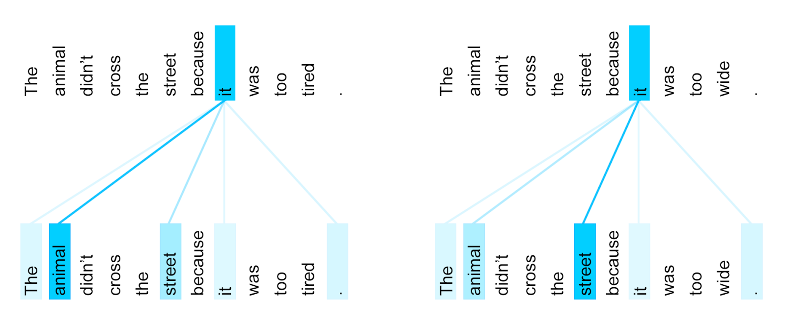
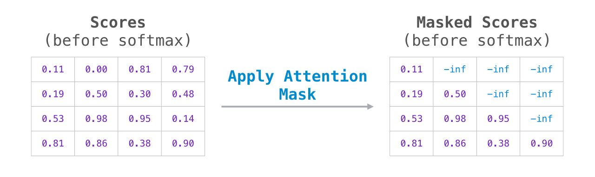

# 이지명

생성일: 2023년 3월 27일 오후 2:54

### multi-head attention

- 하나의 attention을 사용하지 않고 여러개의 attention을 사용해 emsamble 효과
- 각 attention은 더 작은 embedding dimension을 가지게 하여 계산량은 비슷or동일하게 함
- 실제 구현에서는 텐서에 rearrange를 적절히 활용해 single head와 비슷하게 간단하게 구현 가능

### self attention

- query sequence와 key-value sequence를 모두 입력 sequence로 사용

- sequence 내 token 간 long-range dependency를 효율적으로 모델링할 수 있음
    - path 길이가 rnn은 O(n)인 반면 self attention은 O(1) (모든 위치쌍을 한번에 계산하기 때문)

masked attention

- decoder에서 사용
- decoder에서 token을 생성할때, 아직 생성하지 않은 이후 token이 앞에 영향을 주지 않도록 함
    - attention 연산에서 softmax를 취하기 전 가려야 할 부분에 -inf를 더함(attention mask)
    - masked positon에서 softmax의 값(=attention score)이 0이 됨
    
    
    

### residual connection

- He, K., Zhang, X., Ren, S., & Sun, J. (2016). Deep residual learning for image recognition. In *Proceedings of the IEEE conference on computer vision and pattern recognition*
 (pp. 770-778).

### layer normalization

- Ba, J. L., Kiros, J. R., & Hinton, G. E. (2016). Layer normalization. *arXiv preprint arXiv:1607.06450*
.
- position-wise adaptive normalization
- prevents gradient vanishing/exploding, overfitting, accelerates training